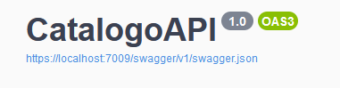
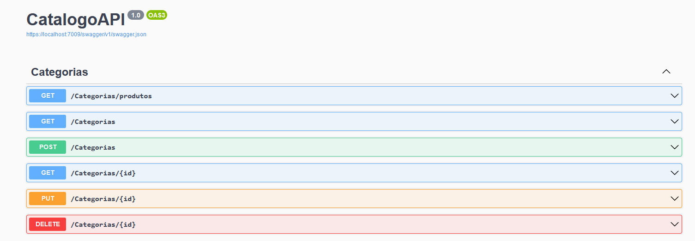
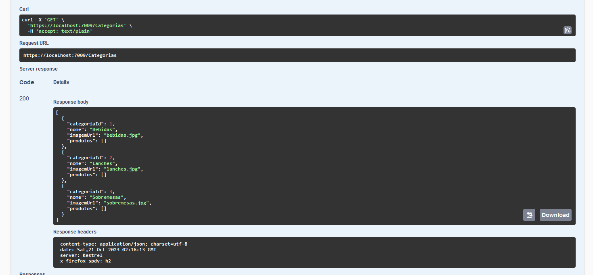
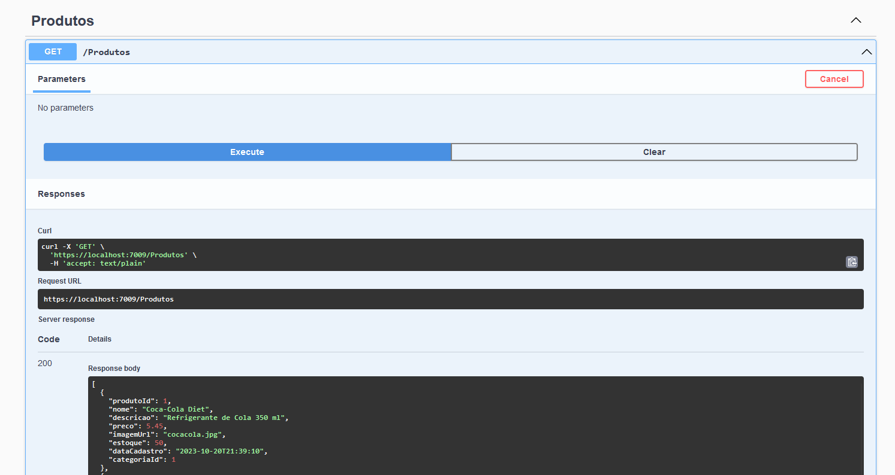

<h1 align="center"> 🖳 Catalogo API - .Net 7 🖳</h1>

    

 <a href="#status">Status</a> • 
 <a href="#objective">Objective</a> •
 <a href="#installation">Development</a> • 
 <a href="#technology">Technology</a> • 
  <a href="#api">API</a> • 
 <a href="#author">Author</a> • 
 <a href="#licence">License</a>

<h2 align="center" id=status> 
	⌛ Concluded ⌛
</h2>

<h2 id=objective>📜 About</h2>
Create an API for a product catalog and its categories. 
This API can serve a network of stores. 
We use .Net 7 with the EntityFrameWork ORM and the MySql database for data persistence.

<h2 id=installation>✔️ Development</h2>

To run this projects you need to follow the steps below:

    1. Create a database and run the script inside SQL folder
    2. Run de API project

Credentials database: 

~~~
root
12345
~~~

### DataBase

This project are using MySql, you can use a instance that you have instaled in your desktop or you can use Docker to create this environment.

<h2 id=technology>🧰 Technology</h2>

The following tools were used in the construction of the project:

- IDE: <a href="https://visualstudio.microsoft.com/pt-br/vs/">Visual Studio 2022</a>
- SDK: <a href="https://dotnet.microsoft.com/pt-br/download/dotnet/7.0">.Net 7</a>
- ORM: <a href="https://learn.microsoft.com/en-us/ef/core/">Entity Framework Core</a>
- MySql: <a href="https://dev.mysql.com/downloads/workbench/">MySQL Workbench 8.0.34 </a>
- Packages: <a href="https://www.nuget.org/">Nuget</a>
- Others: <a href="https://www.connectionstrings.com/mysql/">Connection Strings</a>

<h2 id=api>🖳 API</h2>

Swagger is located inside the "swagger folder".

    

    

    

<h2 id=author>😎 Author</h2>

Developed by <a href="https://www.linkedin.com/in/danhpaiva/" target="_blank">Daniel Paiva</a>

<h2 id=licence>🆓 Licence</h2>

View the license for this project 
<a href="https://github.com/danhpaiva/CatalogoAPI-Net-7/blob/main/LICENSE" target="_blank">MIT</a>
